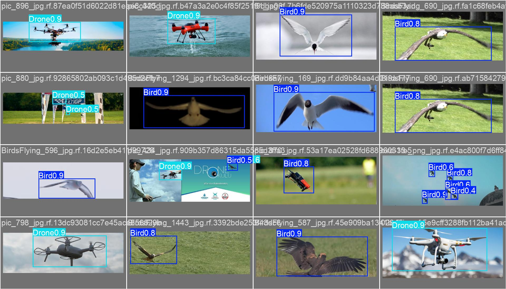
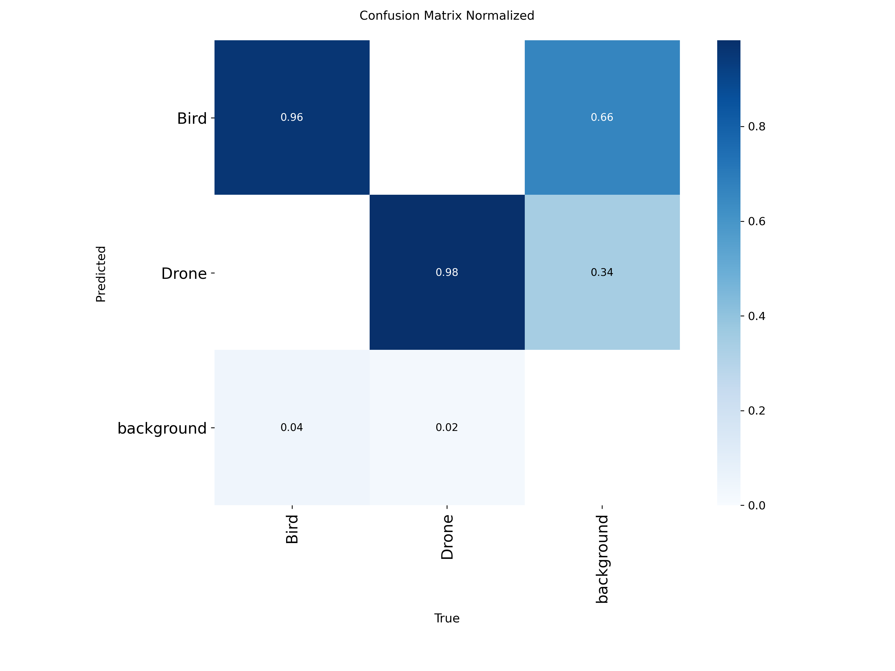
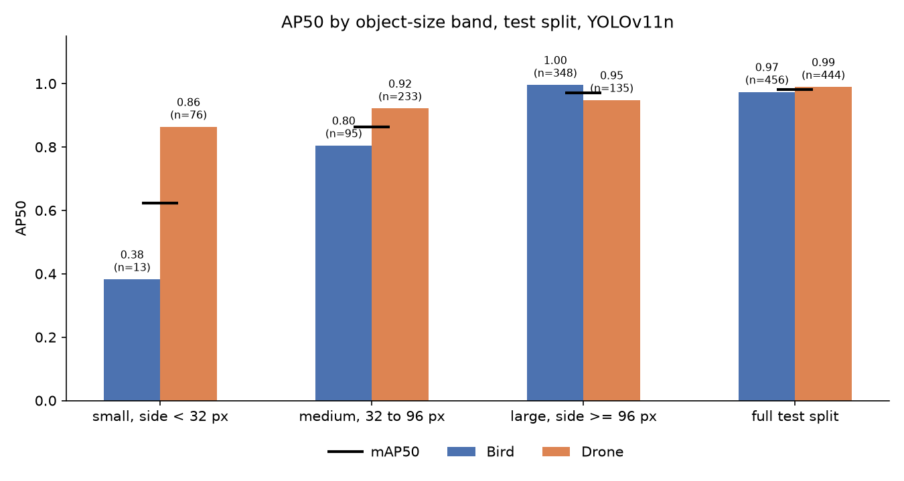
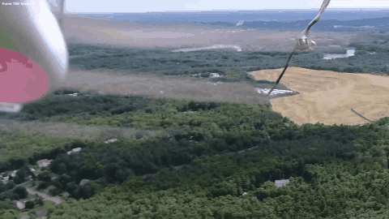

# Drone vs Bird: detection, edge benchmark, and audit

[](https://github.com/victor-ratti/drone-bird-detection/actions/workflows/tests.yml)

Train a small detector to tell drones from birds, measure it on an ARM CPU of
the kind a drone carries, then audit what the headline number actually means.

**In three lines.** A YOLOv11 nano reaches 0.988 mAP50 on this dataset, above
the published reference. Auditing that result shows the classes are 76 %
separable by box size alone, that performance drops to 0.62 on objects under
32 pixels, and that int8 quantization silently destroyed the model before it
was caught and fixed. The repository documents the measurement method as
carefully as the results, because six spectacular numbers along the way turned
out to be artifacts.



## The problem

A drone detection system has to satisfy two constraints at once:

1. **Do not mistake a bird for a drone.** A false alarm on every pigeon makes
   the system unusable.
2. **Run on constrained hardware.** Inference happens on board or in a field
   box, not in a data center.

This project addresses both, and measures both.

## What is in the repository

| Stage | Where | What it does |
|---|---|---|
| Training | `notebooks/01_training_colab.ipynb` | Fine-tunes YOLOv11n on Google Colab (free T4), exports ONNX |
| Evaluation | `src/evaluate.py` | AP50 per class with size-band filtering, on onnxruntime and numpy, no PyTorch |
| Dataset audit | `src/analyze_sizes.py`, `src/size_bias.py` | Object-size distribution, and a no-pixel size-only classifier |
| Benchmark | `src/benchmark.py` | CPU latency with process isolation, thread sweep, dispersion |
| Compression | `src/quantize.py` | Static and dynamic int8 quantization with calibration, detection head kept in float |
| Tracking | `src/track.py` | ByteTrack over a video, annotated output, coverage and fragmentation stats |
| Figures | `src/plot_size_bands.py` | AP50 by size band |
| Tests | `tests/` | IoU, NMS, AP, letterbox mapping, tracking stats and back-projection, pinned to hand-computed values |

The model is the specimen. The evaluator and the benchmark harness are the
instruments, and most of the work went into making the instruments
trustworthy.

## Results

### Detection

YOLOv11 nano, 50 epochs, 1 h 33 on a T4. Details in `results/01_baseline.md`.

| Model | Split | mAP50 | mAP50-95 | Precision | Recall |
|---|---|---|---|---|---|
| Published reference (YOLOv11n) | test | 0.979 | - | - | - |
| **`baseline_n`** | **test** | **0.9878** | **0.7505** | **0.968** | **0.966** |
| `baseline_n` | validation | 0.975 | 0.758 | 0.968 | 0.955 |

Per class on the test split:

| Class | mAP50 | mAP50-95 | Precision | Recall | Instances |
|---|---|---|---|---|---|
| Drone | 0.9928 | 0.738 | 0.984 | 0.982 | 444 |
| Bird | 0.9829 | 0.763 | 0.953 | 0.950 | 456 |



**Reading.**

- **Cross-confusion between drone and bird is essentially null.** Ultralytics'
  matrix rounds both off-diagonal cells to 0.00; the repository's own
  evaluator finds 2 birds predicted as drones out of 456, and 0 drones
  predicted as birds out of 444. The discrimination problem, which is the
  operational problem of counter-drone work, is simply not posed by this
  dataset. That is measured, no longer assumed.
- **The only remaining error mode is the false alarm on empty background**,
  and two thirds of those phantom detections carry the Bird label. On a real
  system, that column is what triggers alerts for nothing.
- **4 % of birds and 2 % of drones are missed.** Small gap, consistent with the
  slight recall deficit on Bird.
- **The gap between mAP50 (0.988) and mAP50-95 (0.751) is the second signal.**
  The model finds objects reliably but places its boxes loosely once strict
  overlap is required. A localization defect, not a detection one. On a
  counter-drone system, box quality drives range estimation and tracking
  stability.

### Hardening: where the 0.98 lies

The headline number mostly measures the easy case. Three independent
measurements show it, details in `results/04_hardening.md`.

**The classes are largely separable by size.** Median side of a bird: 378 px.
Of a drone: 66 px. Ratio 5.72. A single-threshold classifier on box size,
**without looking at a single pixel**, reaches 76.1 % accuracy against 50.7 %
at chance. A quarter of the job is handed over by the dataset's statistics.

**Performance collapses on small objects.** Annotations and predictions
filtered by the same size band.

| Band | Bird AP50 | Drone AP50 | mAP50 |
|---|---|---|---|
| Small, < 32 px | **0.3824** (13 obj.) | 0.8634 (76) | **0.6229** |
| Medium, 32 to 96 px | 0.8047 (95) | 0.9215 (233) | 0.8631 |
| Large, >= 96 px | 0.9957 (348) | 0.9478 (135) | 0.9718 |
| Full test split | 0.9736 (456) | 0.9892 (444) | 0.9814 |



**mAP50 goes from 0.981 to 0.623 on small objects, and the Bird class falls to
0.382.** Birds in this dataset are almost always large, so the model never
learned to recognize a small bird.

**And the dataset does not contain the hard case**: 13 small birds in the
whole test split. The operational counter-drone problem, telling a small
flying object from a bird at range, is represented neither in quantity nor in
difficulty.

### Speed and size on ARM CPU

Measured on 2026-09-08 with 10 intra-op threads, 4 independent passes per
model, each in a fresh process, idle machine. Protocol and measurement pitfalls
in `results/02_benchmark_protocol.md`, analysis in `results/03_quantization.md`.

| Model | Format | Size | mAP50 full | mAP50 small | Median | Dispersion | FPS |
|---|---|---|---|---|---|---|---|
| `baseline_n` | ONNX fp32 | 10.11 MB | **0.9814** | **0.6229** | **25.61 ms** | x1.12 | **39.1** |
| `baseline_n` | ONNX int8 static | 3.05 MB | 0.9565 | 0.4811 | 38.99 ms | x1.05 | 25.6 |
| `baseline_n` | ONNX int8 dynamic | 2.85 MB | 0.9833 | not measured | 190 to 810 ms | x4.26 | 2 to 5 |

**The fp32 model holds real time on an ARM CPU with no accelerator**, at 39.1
frames per second.

**Int8 quantization does not speed this model up on this target, it slows it
down.** Static: 1.52x slower. Dynamic: erratic, bimodal between roughly 200 and
800 ms across passes, so a range is quoted rather than a figure. The size gain
is real, a factor 3.31.

**And static quantization first destroyed the model outright.** Its class
scores collapsed to exactly zero, mAP50 0.0000, every one of 900 objects
missed, while the box coordinates stayed intact. Cause, read off the graph: a
YOLO export ends with a `Concat` merging box coordinates in pixels (0 to 640)
with class probabilities (0 to 1), and per-tensor quantization gave that
concatenation a single scale of 2.53. In uint8 the smallest representable
non-zero value is then larger than any probability. Keeping three head nodes in
floating point fixes it at no speed cost, 38.99 against 39.06 ms. Full account
in `results/03_quantization.md`.

**Accuracy after the fix costs 2.5 points overall, but 14 on small objects**:
0.9814 to 0.9565 on the full split, 0.6229 to 0.4811 under 32 pixels, a 23 %
relative drop. Compression takes its price where the model was already
weakest, which is where the operational case lives. Dynamic quantization, which
only touches weights, costs nothing in accuracy and everything in speed.

The cause is not the model but the backend: onnxruntime's fp32 path uses NEON
kernels tuned for ARM64, while the default CPU executor's int8 path has no
equally mature equivalent and falls back to generic implementations.

**Conclusion that carries over to embedded deployment: the choice of backend
precedes the choice of weight format.** Quantizing before knowing what the
target runtime can execute is wasted time. The gain would exist on the NPU via
the QNN execution provider, on XNNPACK, or on a Jetson target with TensorRT.

Thread count matters as much as the model: 1 thread gives 331 ms, 10 threads
give 24. On a drone's compute board, that setting is a deployment decision,
not a detail.

Measurement machine: Snapdragon X Elite X1E80100, 12 cores, Windows 11 ARM64,
no discrete GPU. Deliberate choice: this architecture is closer to the compute
boards drones carry than a desktop graphics card is.

### Tracking on real footage

ByteTrack on top of the detector, over two continuous shots from Wikimedia
Commons. No annotated trajectories exist for public drone footage, so the
metrics are coverage, fragmentation and track length; MOTA and IDF1 wait for
Anti-UAV. Details in `results/05_tracking.md`.



| Shot | Detector threshold fed to the tracker | Frames with track | Coverage | Tracks | Breaks |
|---|---|---|---|---|---|
| Hovering drone, 603 frames, one object | 0.25 | 317 | 0.79 | 2 | 1 |
| Hovering drone, 603 frames, one object | **0.10** | **543** | **0.98** | **1** | **0** |
| Hawk, three attack passes, 855 frames | 0.25 | 186 | 0.72 | 3 on the hawk, 2 on ground structures | 0 within a pass |
| Hawk, three attack passes, 855 frames | 0.10 | 198 | 0.47 | 3 on the hawk, 2 on ground structures, 1 blur | 0 within a pass |

**Feeding low-score detections to the tracker is what makes ByteTrack work,
and only when the object is actually there.** On the hovering shot, going from
0.25 to 0.10 turns two ids with a 137-frame gap into one id over 543 frames:
the drone never leaves, its confidence dips in gusts, the second association
stage bridges the dips. On the hawk, the same change buys nothing: the bird
leaves the frame between passes, and a motion-only tracker cannot re-identify
after a true absence. Judged per continuous appearance, no pass breaks.

Two more things the footage exposed. The hawk filling the frame is classified
Bird at 0.78, the hovering drone filling the frame is classified Drone at
0.38: the size bias of the training set, seen from the other side. And three
of the five videos found were edited documentaries, useless as benchmarks;
the harness gained `--start` and `--end` to isolate one continuous shot.

Tracking adds under 1 ms per frame. At 1080p, decoding and letterboxing cost as
much as the network: 22 FPS end to end, against 39.1 FPS for inference alone.

## Measurement method

Six spectacular results in this project turned out to be artifacts. Five were
caught by a reproducibility check rather than by a better explanation; the
sixth by measuring something the benchmark could not see.

1. **A thread sweep showing non-monotonic latency and an 8x penalty at 12
   threads.** onnxruntime does not release thread pools between sessions; the
   harness was measuring its own leak. Fix: one fresh process per measurement.
2. **Dynamic quantization measured 84x slower.** A polluted run. Replayed over
   four independent passes: 8.3x.
3. **mAP50 of 0.098 on small objects.** Only annotations were size-filtered,
   not predictions, so every correct large detection counted as a false
   positive. The confusion matrix, computed differently, contradicted it.
4. **An 82-frame "longest track" on the hawk video.** It was the tracker's
   id -1, the bucket of tentative detections not yet confirmed, counted as a
   track. And the first tracking runs pre-filtered detections at the
   tracker's own activation threshold, disabling the low-score recovery that
   is the point of ByteTrack. Both fixed before any number was written down.
5. **A quantized model timed at a clean, reproducible 39.8 ms while detecting
   nothing.** Static int8 had annihilated every class score; the file loaded,
   ran, and returned well-formed tensors. No reproducibility check could have
   found it, only an accuracy run. Rule added to the protocol: never benchmark
   a transformed model before checking its accuracy on the same file.
6. **A dynamic-quantization latency of 209.72 ms with 3 % dispersion**, which a
   later replay contradicted at 190 to 810 ms with 326 % dispersion. That path
   is bimodal on this machine; the README quotes a range, not a number.

Superseded runs are kept in `results/superseded/` for the record. None of
their numbers is cited.

## Dataset

[Drone-Bird-Detection](https://universe.roboflow.com/myworkspace-0p4nk/drone-bird-detection-3nl79),
version 3 `drone-bird-nonaugmented`, published on Roboflow Universe under
CC BY 4.0. Not redistributed here; `src/download_data.py` fetches it.

- 7737 images, split 5418 train / 1547 validation / 772 test
- Two classes: `Bird`, `Drone`
- No augmentation applied upstream, so no leakage between splits

```
@misc{ drone-bird-detection-3nl79_dataset,
  title = { Drone-Bird-Detection Dataset },
  type = { Open Source Dataset },
  author = { MyWorkspace },
  howpublished = { \url{ https://universe.roboflow.com/myworkspace-0p4nk/drone-bird-detection-3nl79 } },
  journal = { Roboflow Universe },
  publisher = { Roboflow },
  year = { 2024 },
}
```

**Known limit.** The published reference reaches 0.979 mAP50, which indicates
an easy dataset: objects are large and sharp. Long-range drone / bird
discrimination, the real operational problem, is not represented. Quantified
in the hardening section.

## Status

- [x] **Detection.** YOLOv11n, mAP50 0.9878 on the test split, above the
      published reference.
- [x] **Compression.** Static and dynamic int8 measured on ARM CPU, accuracy
      included. Negative result on speed, cause identified: the backend, not
      the model.
- [x] **Hardening.** mAP50 from 0.981 to 0.623 under 32 px, Bird at 0.382.
      Scale bias of 5.72 between classes; a size threshold alone reaches
      76.1 %.
- [x] **Tracking.** ByteTrack over two continuous shots. Low-score recovery
      turns 2 ids into 1 on a hovering drone; it cannot re-identify a hawk
      that leaves the frame between passes.
- [x] **Accuracy of the quantized models.** Static int8 first scored 0.0000, a
      silent failure traced to a single quantization scale over a tensor mixing
      pixels and probabilities. Fixed; it now costs 2.5 points overall and 14
      on small objects. Dynamic int8 costs nothing in accuracy.
- [ ] **Anti-UAV.** Rerun the three hardening measurements on a dataset that
      contains the hard case, and compute MOTA and IDF1 on its annotated
      sequences.
- [ ] **NPU.** onnxruntime-qnn on the Snapdragon, where int8 should pay off.

## Reproduce

### Training, on Google Colab

1. Open `notebooks/01_training_colab.ipynb` in Colab.
2. Enable the T4 GPU: `Runtime` > `Change runtime type`.
3. Paste a Roboflow API key in cell 3.
4. Run the cells top to bottom. Cell 8 downloads a zip with weights and figures.

### Measurement, locally on CPU

Tested on Windows 11 ARM64 with Python 3.14. Any platform with onnxruntime
wheels should work.

```bash
python -m venv .venv
.venv/Scripts/python -m pip install -r requirements.txt     # .venv/bin/python on Linux and macOS
```

```bash
# tests on the evaluator's arithmetic
.venv/Scripts/python -m pytest tests -q

# dataset (put ROBOFLOW_API_KEY=... in a .env file at the project root first)
.venv/Scripts/python src/download_data.py

# accuracy, full split then small objects only
.venv/Scripts/python src/evaluate.py models/baseline_best.onnx data/Drone-Bird-Detection-3
.venv/Scripts/python src/evaluate.py models/baseline_best.onnx data/Drone-Bird-Detection-3 --max-side 32

# dataset audit
.venv/Scripts/python src/analyze_sizes.py data/Drone-Bird-Detection-3
.venv/Scripts/python src/size_bias.py data/Drone-Bird-Detection-3

# latency, fp32 against both int8 variants, and a thread sweep
.venv/Scripts/python src/benchmark.py models/*.onnx --threads 10
.venv/Scripts/python src/benchmark.py models/baseline_best.onnx --sweep 1,2,4,8,12

# tracking over a continuous shot (any video opencv can read), feed low scores to the tracker
.venv/Scripts/python src/track.py models/baseline_best.onnx data/videos/clip.webm \
    --out results/tracking/clip --conf 0.10 --expected-objects 1 --gif

# rebuild the quantized models
.venv/Scripts/python src/quantize.py models/baseline_best.onnx --mode dynamic
.venv/Scripts/python src/quantize.py models/baseline_best.onnx --mode static \
    --calibration data/Drone-Bird-Detection-3/valid/images --n 200
```

Latency numbers will differ on another machine. The protocol in
`results/02_benchmark_protocol.md` is what transfers.

## Repository layout

```
drone-bird-detection/
├── notebooks/     training, runs on Google Colab
├── src/           evaluation, audit, benchmark and quantization scripts, run locally
├── tests/         unit tests on the evaluator core
├── models/        exported ONNX: fp32, both int8 variants, and the broken
│                   head-quantized file kept as evidence
├── results/       training figures, evaluation and benchmark JSON, step write-ups
│   ├── figures/       generated charts
│   └── superseded/    runs from the flawed harness, kept for the record
└── data/          dataset, not versioned
```

## With one more month

In order of expected return.

1. **Rerun the audit on Anti-UAV.** The size-band evaluator and the
   size-only classifier are the two tools that expose a dataset's real
   difficulty. Running them on a set that contains small, distant, ambiguous
   objects would turn the hardening section from a diagnosis into a result.
2. **Track on the intended scene, with ground truth.** The harness works,
   but public footage gave a drone's point of view and a top-down close-up,
   never a small drone in the sky filmed from the ground. Anti-UAV has that,
   with annotated trajectories: MOTA and IDF1 instead of coverage and
   fragmentation.
3. **Measure int8 where it should win.** QNN execution provider on the
   Snapdragon NPU, and XNNPACK on the CPU. If neither helps, the "backend
   first" conclusion is confirmed on two more backends; if one does, the
   size and speed gains finally line up.
4. **Localization, not detection.** The 0.988 to 0.751 gap between mAP50 and
   mAP50-95 says boxes are loose. A higher input resolution or a small model
   variant would tell whether it is a capacity or a resolution problem.
5. **Train on small objects on purpose.** Oversample the under-32 px
   instances, or tile the images, and measure whether Bird AP50 on small
   objects moves from 0.38. If it does not, the data is the limit, and that is
   worth knowing before buying hardware.

## License

Code under MIT, see `LICENSE`. The dataset is CC BY 4.0 by its authors and is
not redistributed.
